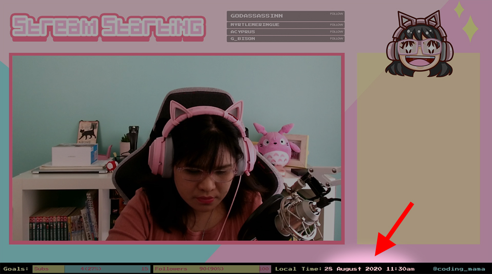
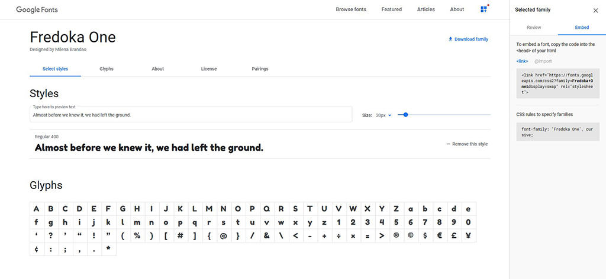

# Local Time Browser Source

Place a widget on your stream overlay that displays your local time!

## Example
Click [here](https://cdmama.github.io/obs-sources/local-time/sample.html) to see a working example.

## How to Use

Copy the code from [here](https://raw.githubusercontent.com/cdmama/obs-sources/master/local-time/sample.html) and save as an HTML file called `local-time.html`.

Open this file in your favourite code or text editor.

### Changing the Font

Go to [Google Fonts](https://fonts.google.com) and choose the font you want to use.

* On the page of the Google Font you have chosen, click **Select this style**.  If the Selected Family sidebar doesn't appear on your screen, select the *View Your Selected Families* icon on the top menu.

* On the Selected Family sidebar, click **Embed**. You should see the instructions on how to embed the font. Take note of the code snippets in the two boxes.

Back to `local-time.html`:

* Replace line 7 (`<link href="https://fonts.googleapis.com/css2?family=Press+Start+2P&display=swap" rel="stylesheet">`) with the code snippet in the first box. Make sure **\<link\>** is selected and not **@import**.

* Replace line 10 (`font-family: 'Press Start 2P', cursive;`) with the code snippet in the second box.

### Make the text bigger/smaller

On line 11 of `local-time.html`, change `16px` to a bigger or smaller value. (Don't forget to add `px` to the end of the number.)

### Changing the text colour

On line 12 of `local-time.html`, change `pink` to a different colour (e.g. `blue`). You may also use hex colour values (e.g. `#ccffcc`).

### Changing the date/time format

On line 23 of `local-time.html`, you should see the text `dd MMMM yyyy h:mma`. This controls the format of the displayed date and time based on [this reference](https://moment.github.io/luxon/docs/manual/formatting#table-of-tokens).

For example, if you would like to display a date and time similar to *Friday Nov 13 2020 12:00 AM*, change the format to `EEEE MMM d yyyy h:mm a`.

### Placing the widget on your stream overlay

Create a new browser source on your streaming software. 

* On OBS Studio, tick **Local File** and click the Browse button. Select `local-time.html` from your file system.

### Questions?

Ping me on [Discord](https://discord.gg/a9sJHUu) in the #help-please channel if you need more assistance! 